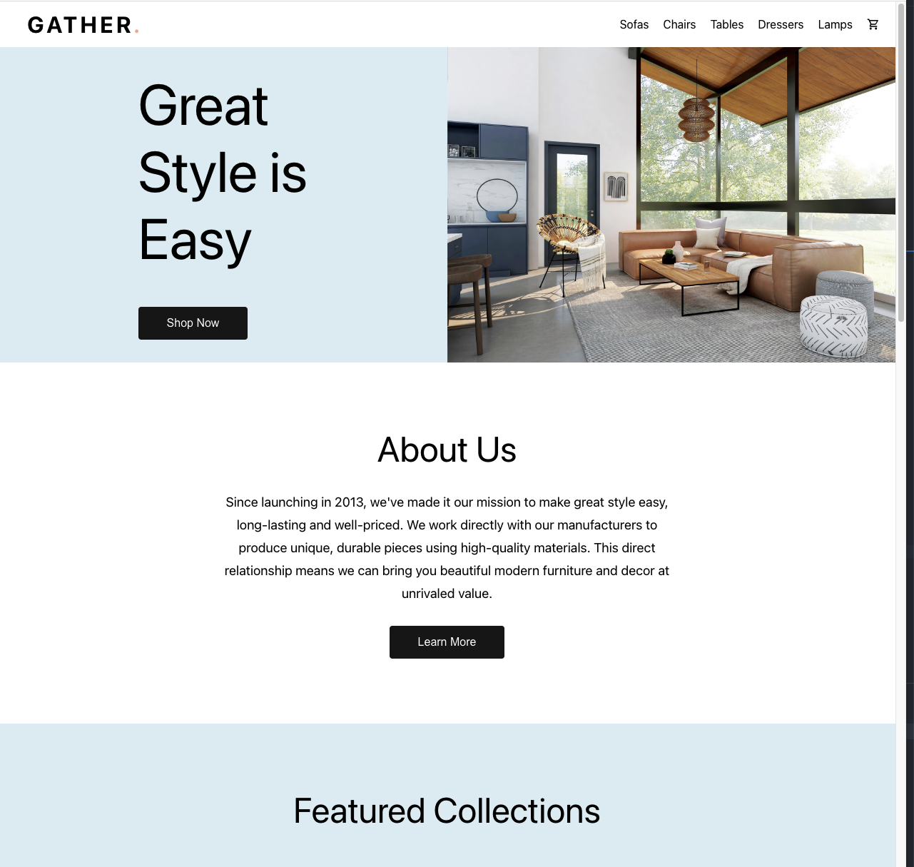
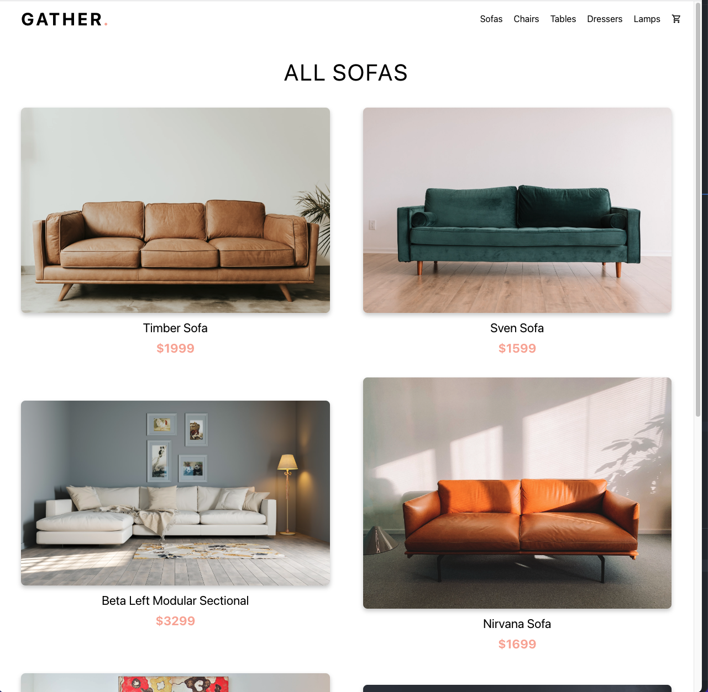
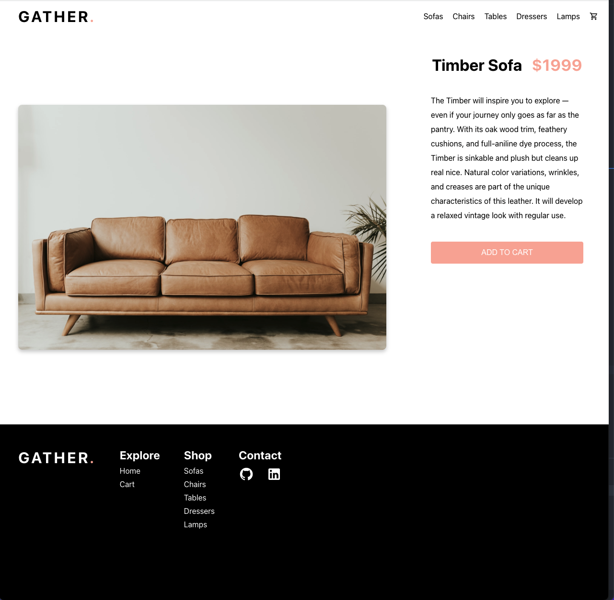
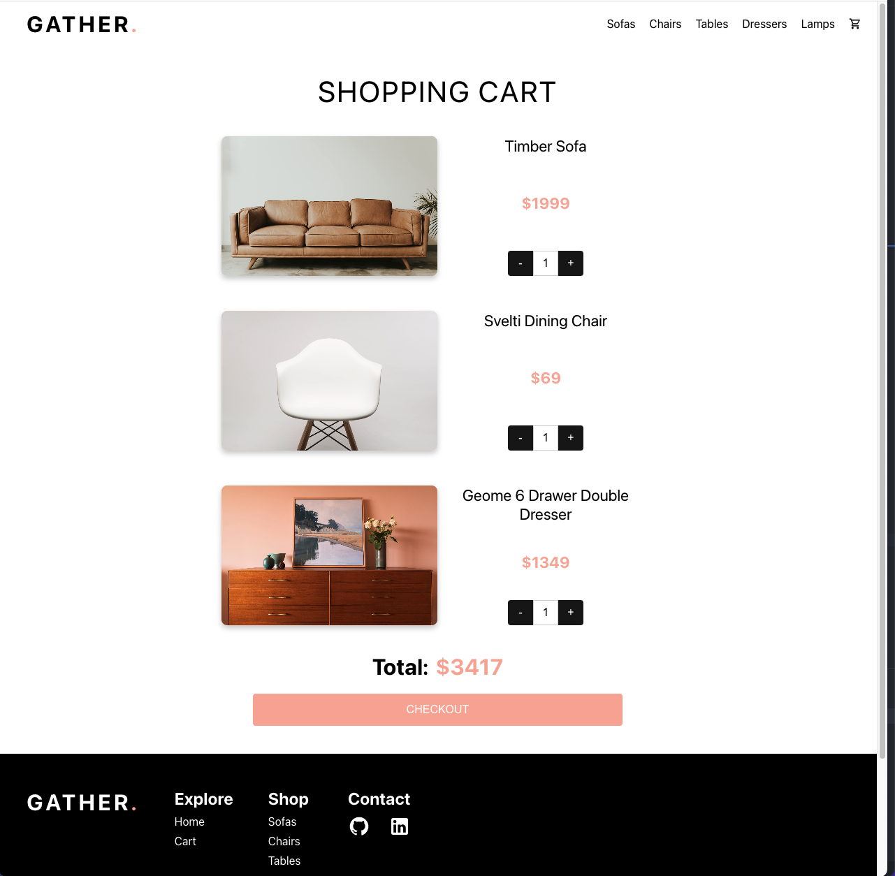

## GATHER

A furniture e-commerce front-end application built with React, React Router, JavaScript, and CSS.

## Project Status
This project is largely complete from a front-end perspective.  However, I intend to extend the applicationt to include additional functionality as I learn new skills.  Examples include:
  - Tweaks to the UI, such as product image sizes
  - An About Us page and functionality to navigate to it
  - Functionality to navigate to an All Furniture page
  - A back-end to store product data and handle CRUD operations
  - Functionality to persist a user's cart with use of localStorage

## Project Screen Shot(s)

#### Home Page  

#### Shop Page

#### Product Page

#### Cart Page

## Installation and Setup Instructions  

Clone down this repository. You will need `node` and `npm` installed globally on your machine.  

Installation:

`npm install`  

To Run Test Suite:  

`npm test`  

To Start Server:

`npm start`  

To Visit App:

`localhost:3000`  

## Reflection

This was a 1+ month long project built on nights and weekends as part of The Odin Project course.  The original goal was to implement React Router which I had recently learned.  Project goals evolved from there to treat it as a stretch assignment to use all of the technologies I learned up until this point, with a strong emphasis on React and React functional components.

I wanted to really stretch my front-end "muscles" and challenge myself to create what I considered a legitmately good looking application with the core functionality of an e-commerce site, albeit without a back-end.

The technologies implemented in this project are React, React-Router, JSX, VanillaJS, and CSS.
